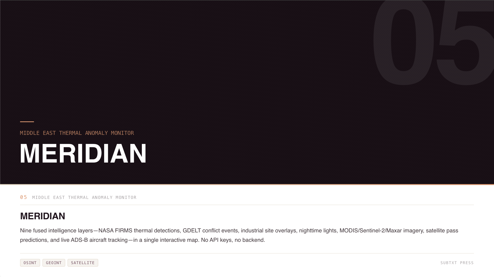

# MERIDIAN

**Middle East Regional Intelligence Dashboard for Infrared Anomaly Notification**

A zero-dependency, single-file OSINT tool for monitoring thermal anomalies, infrastructure impact, conflict events, and maritime activity across the Middle East theater. Built for investigative journalists, OSINT analysts, and GIS researchers.



## What It Does

MERIDIAN fuses five open-source intelligence layers into a single interactive map:

- **Thermal Anomalies** — Near real-time fire and heat detections from NASA FIRMS across four satellite sensors (VIIRS NOAA-20, NOAA-21, Suomi-NPP, MODIS Aqua/Terra). Filterable by confidence level, satellite source, time range, and geographic region.
- **Industrial Sites** — 108 known refineries, power plants, gas processing facilities, and petrochemical complexes. Detections within ~2km of these sites are automatically tagged and visually de-emphasized to separate routine industrial flaring from conflict-relevant activity.
- **Conflict Events** — ACLED armed conflict data (battles, explosions, violence against civilians) with event-type filtering and temporal alignment to thermal detections.
- **Nighttime Lights** — NASA GIBS VIIRS Day/Night Band imagery with before/after comparison mode for assessing infrastructure damage and power grid disruption.
- **Maritime Traffic** — AIS vessel pattern data for the Strait of Hormuz, showing tanker, cargo, naval, and other vessel activity along Traffic Separation Scheme lanes.

## Key Features

- **Live data** — Pulls directly from NASA FIRMS API with CORS proxy fallback. No API key required for open data mode.
- **Confidence filtering** — Defaults to high-confidence detections only. Nominal and low thresholds available for full coverage including agricultural burns and sensor noise.
- **Proximity tagging** — Automatic spatial analysis flags detections near known industrial infrastructure, helping analysts distinguish conflict signatures from routine operations.
- **Timeline animation** — Step through each day of the observation window with play/pause controls at 1x/2x/4x speed.
- **Shareable views** — Current map state (position, zoom, active layers, filters) encoded into a URL hash for one-click sharing.
- **Export** — Screenshot the current view as a PNG with title bar, legend overlay, detection stats, and source attribution baked in.
- **Responsive** — Works on desktop, tablet, and mobile. Sidebar auto-collapses on small screens.

## Architecture

The entire application is a single HTML file (~3,300 lines). No build step, no backend, no dependencies to install. Open it in a browser and it works.

**Stack:** MapLibre GL JS v4.1.2 / Turf.js v7 / IBM Plex typography / CartoDB + Esri basemaps

**Data sources:**
| Layer | Source | Update Frequency |
|-------|--------|-----------------|
| Thermal | [NASA FIRMS](https://firms.modaps.eosdis.nasa.gov/) | Near real-time (~3hr latency) |
| Industrial | [EOG/VIIRS Nightfire](https://eogdata.mines.edu/products/vnf/global_gas_flare.html), [World Bank GGFR](https://www.worldbank.org/en/programs/gasflaringreduction) | Static catalog |
| Conflict | [ACLED](https://acleddata.com) | Embedded dataset |
| Nighttime | [NASA GIBS](https://earthdata.nasa.gov/gibs) VIIRS DNB | Daily composites |
| Maritime | OSINT AIS reporting | Representative patterns |

## Usage

```
# No install required — just open in a browser
open meridian.html
```

1. Click **Load Satellite Data** to pull the latest detections from NASA FIRMS
2. Use the confidence, satellite, and time filters to narrow the signal
3. Toggle overlay layers (Industrial Sites, Conflict Events, Nighttime Lights, AIS Vessels) for multi-source analysis
4. Click any detection for full metadata including satellite, FRP, brightness temperature, and industrial proximity
5. Use **Share View** to copy a stateful URL or **Export** to save a publication-ready screenshot

## License

Data attributions: NASA FIRMS, NASA GIBS, ACLED, EOG/VIIRS Nightfire, World Bank GGFR, OpenStreetMap.

Built by [Subtxt Press](https://subtxtpress.github.io/home/)
